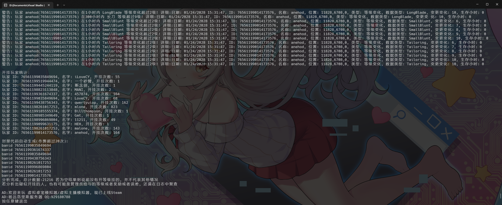

# PZCheatFinder 僵毁等级挂检测工具

这款软件是专为《僵尸毁灭工程》游戏设计的数据分析工具，专门用于监控玩家的游戏行为并检测可能的作弊行为。它通过分析游戏等级日志数据，提取并理解各种类型的游戏事件，包括玩家的创建、技能等级的变化以及玩家的初始化数据。

以下是该软件的主要功能：

1. **数据解析**：软件能够解析《僵尸毁灭工程》游戏日志中的各种数据，包括日期、玩家ID、玩家名字、位置、事件类型、技能等级等。所有这些数据都会被整理并存储在一个特定的数据结构中，以便后续的分析。
2. **作弊检测**：软件能够检测玩家的作弊行为。具体来说，如果一个玩家在1小时内的技能等级变化超过2级（不包括初始化），软件会认定该玩家可能存在作弊行为，并输出一条警告信息。
3. **作弊统计**：软件会统计所有被认定为可能存在作弊行为的玩家，包括他们的ID、名字以及作弊的次数。这些统计结果会在所有数据分析完成后输出。
4. **一键封禁**：自动生成疑似作弊超过20次以上的玩家封禁代码,可以直接在服务器里输入即可

这款软件是一个强大的《僵尸毁灭工程》游戏数据分析工具，可以帮助游戏开发者和运营者更好地理解玩家的行为，提高游戏的公平性，提升玩家的游戏体验。

**注意! 如果有MOD会修改等级,并且轻松拉满等级, 可能并不适用本检测工具**

## 如何使用

### 1. 获取服务器等级变化日志

日志一般在 `{我的文档}/Zomboid/Logs` 目录下 找到`日期_PerkLog.txt` 文件

不同服务器位置可能不一致

### 2. 启动软件 `PZCheatFinder.exe`

输入文件所在目录或拖动文件到窗口上即可, 然后按回车继续

### 3. 程序分析完成

程序会自动分析不合理数据, 并统计不合理次数

因为分析原理是根据等级判断和历史经验, 所以可能会有误判, 建议往前翻查看具体原因复查

复制粘贴代码即可直接封禁外挂玩家

**注意! 如果有MOD会修改等级,并且轻松拉满等级, 可能并不适用本检测工具**